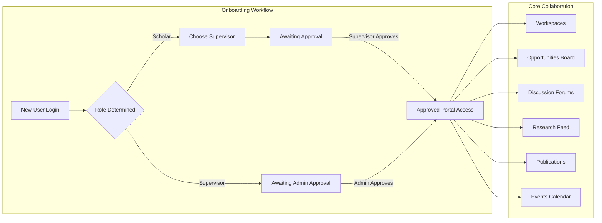
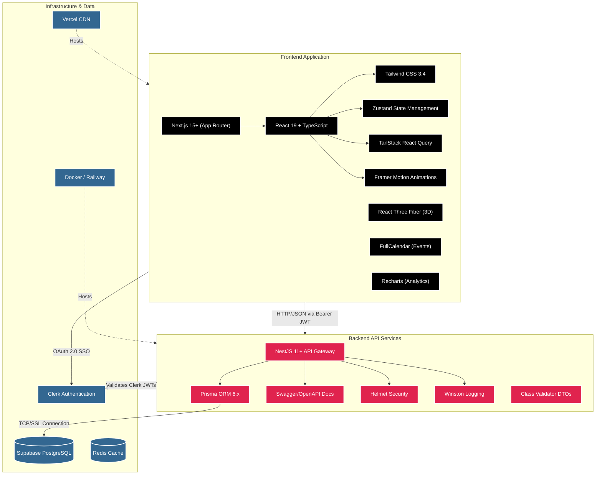
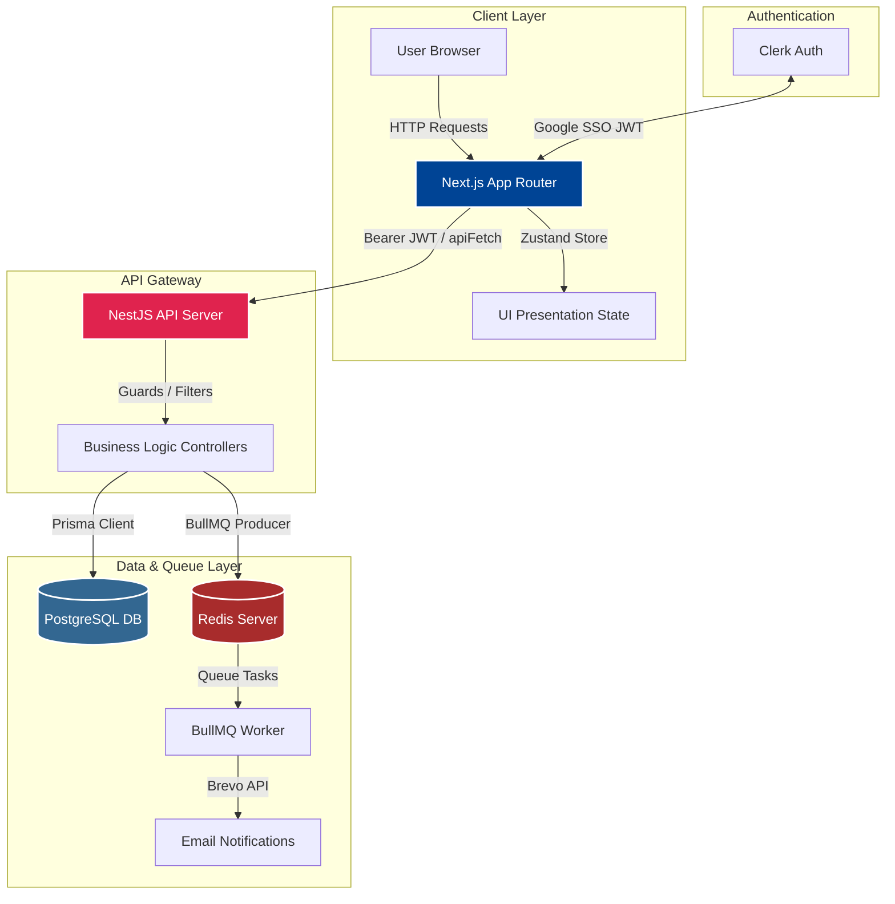
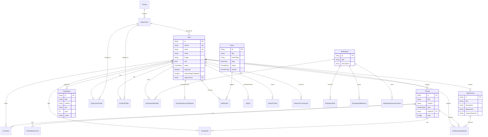
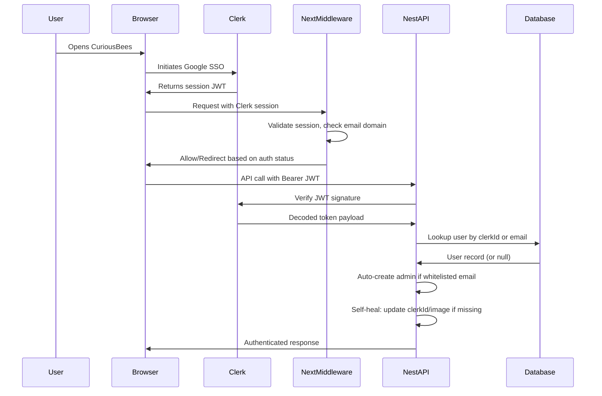
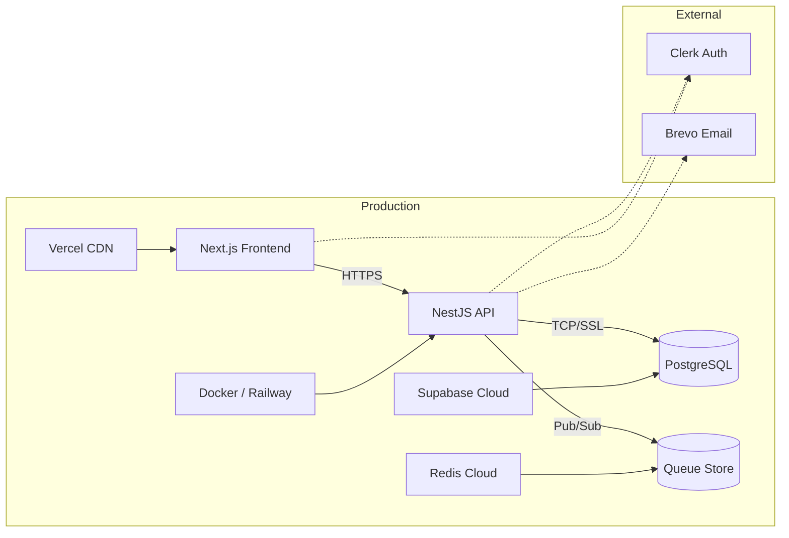

# CuriousBees V2 — Complete Project Documentation

<div align="center">
<strong>AI-Powered Academic Research Collaboration Platform</strong><br/>
Version 1.0.0 &nbsp;|&nbsp; Report Date: August 10, 2026
</div>

---

## Table of Contents

1. [Executive Summary](#1-executive-summary)
2. [Project Overview](#2-project-overview)
3. [Technology Stack](#3-technology-stack)
4. [System Architecture](#4-system-architecture)
5. [Monorepo Structure](#5-monorepo-structure)
6. [Database Schema & Data Model](#6-database-schema--data-model)
7. [Backend API Modules](#7-backend-api-modules)
8. [Frontend Application](#8-frontend-application)
9. [Authentication & Authorization](#9-authentication--authorization)
10. [Shared Packages](#10-shared-packages)
11. [API Endpoints Reference](#11-api-endpoints-reference)
12. [Deployment Architecture](#12-deployment-architecture)
13. [DevOps & CI/CD](#13-devops--cicd)
14. [Environment Configuration](#14-environment-configuration)
15. [Development Workflow](#15-development-workflow)
16. [Version History & Changelog](#16-version-history--changelog)
17. [Product Roadmap](#17-product-roadmap)
18. [Contributing Guidelines](#18-contributing-guidelines)

---

## 1. Executive Summary

**CuriousBees V2** is a centralized, digital **Research Collaboration Platform** designed specifically for modern university ecosystems. It replaces fragmented academic communication channels — such as emails, external chats, and shared file drives — with a unified, secure environment dedicated to academic supervision, project tracking, research discovery, and scholarly collaboration.

The platform integrates three primary user personas — **Research Scholars**, **Research Supervisors**, and **Institutional Administrators** — into a single environment that streamlines research workflows from onboarding to publication.

### Key Highlights

| Attribute            | Details                                      |
| -------------------- | -------------------------------------------- |
| **Project Name**     | CuriousBees V2                               |
| **Project Type**     | Full-Stack Web Application (Monorepo)        |
| **Version**          | 1.0.0                                        |
| **Primary Language** | TypeScript (Strict Mode)                     |
| **Frontend**         | Next.js 15+ (App Router) with React 19       |
| **Backend**          | NestJS 11+ with Prisma ORM                   |
| **Database**         | PostgreSQL (Supabase-hosted)                 |
| **Authentication**   | Clerk Authentication (Google OAuth SSO)      |
| **State Management** | Zustand + React Query                        |
| **Deployment**       | Vercel (Frontend) + Docker/Railway (Backend) |
| **Node.js Version**  | >= 22.x                                      |

---

## 2. Project Overview

### 2.1 Problem Statement

University research ecosystems typically rely on fragmented tools — email threads for supervision, Google Drive for document sharing, WhatsApp groups for notifications, and spreadsheets for progress tracking. This leads to:

- **Communication silos** between scholars, supervisors, and administrators.
- **Lack of discoverability** — scholars cannot easily find cross-disciplinary collaboration opportunities.
- **Inefficient approval workflows** — supervisor-scholar assignment, progress reporting, and administrative approvals are handled manually.
- **No centralized audit trail** of academic activities.

### 2.2 Solution

CuriousBees V2 provides:

- **Unified Portal** — A single platform for all research-related interactions.
- **Role-Based Dashboards** — Tailored interfaces for Scholars, Supervisors, and Admins.
- **Structured Workflows** — Digital onboarding, supervisor approval chains, and progress reporting.
- **Collaboration Tools** — Discussion forums, research workspaces, and an opportunities board.
- **Social Research Feed** — A LinkedIn-style feed for sharing research updates, publications, and achievements.
- **Real-time Notifications** — Background job queues for push alerts and email notifications.

### 2.3 User Personas & Journeys

#### Research Scholars (PhD / Researchers)

- Register using their university Google accounts (restricted to `@srmist.edu.in` domains).
- Complete an onboarding wizard to set their faculty, department, and research interests.
- Search the supervisor directory and send a supervision request.
- Once approved by a supervisor, the full dashboard unlocks — providing access to Workspaces, Opportunities, Discussion Forums, and the Research Feed.
- Post periodic progress reports and track milestones within their assigned workspaces.

#### Research Supervisors (Faculty Members)

- Receive and review supervision requests from scholars.
- Create dedicated research workspaces for active grants and projects.
- Post open research positions and assistantship roles to the Opportunities Board.
- Review scholar progress reports and provide feedback.
- Engage in cross-disciplinary discussions through the global thread forum.

#### Institutional Administrators (University Officials)

- Maintain a bird's-eye view of all platform activity.
- Manage the Faculty and Department hierarchy.
- Promote users, verify credentials, suspend accounts, and manage global announcements.
- Monitor audit logs for compliance with university research standards.

### 2.4 System Modules & Workflows



---

## 3. Technology Stack

### 3.1 Stack Overview



### 3.2 Detailed Technology Matrix

| Layer                  | Technology                          | Version                       | Purpose                                        |
| ---------------------- | ----------------------------------- | ----------------------------- | ---------------------------------------------- |
| **Runtime**            | Node.js                             | >= 22.x                       | Server and build runtime                       |
| **Language**           | TypeScript                          | 5.4+                          | Strict type safety across all packages         |
| **Frontend Framework** | Next.js                             | 15.3+                         | React meta-framework with App Router           |
| **UI Library**         | React                               | 19.x (RC)                     | Component rendering engine                     |
| **Styling**            | Tailwind CSS                        | 3.4                           | Utility-first CSS framework                    |
| **State Management**   | Zustand                             | 4.5                           | Lightweight global state                       |
| **Server State**       | TanStack React Query                | 5.x                           | API response caching and synchronization       |
| **Animations**         | Framer Motion                       | 11.x                          | Declarative micro-animations                   |
| **3D Graphics**        | React Three Fiber + Drei            | 9.x / 10.x                    | 3D visual elements on marketing pages          |
| **Charts**             | Recharts                            | 3.8                           | Dashboard analytics and data visualization     |
| **Calendar**           | FullCalendar                        | 6.1                           | Interactive event calendar views               |
| **Forms**              | React Hook Form + Zod               | 7.x / 3.x                     | Type-safe form validation                      |
| **Icons**              | Lucide React                        | 0.379                         | SVG icon library                               |
| **Backend Framework**  | NestJS                              | 11.1+                         | Modular Node.js API framework                  |
| **ORM**                | Prisma                              | 6.19+                         | Type-safe database access layer                |
| **API Docs**           | Swagger (OpenAPI)                   | 8.0                           | Auto-generated interactive API documentation   |
| **Validation**         | class-validator / class-transformer | 0.14 / 0.5                    | DTO-based request payload validation           |
| **Security**           | Helmet                              | 7.1                           | HTTP security headers                          |
| **Logging**            | Winston + nest-winston              | 3.11 / 1.9                    | Structured, transport-based logging            |
| **Compression**        | compression                         | 1.7                           | Response GZIP compression                      |
| **Export**             | xlsx                                | 0.18                          | Excel file generation for admin reports        |
| **Schema Validation**  | Zod                                 | 3.25+                         | Shared validation schemas (frontend + backend) |
| **Database**           | PostgreSQL                          | 15                            | Relational data storage                        |
| **Caching/Queues**     | Redis                               | 7                             | Background job queues                          |
| **Authentication**     | Clerk                               | 7.4 (Next.js) / 3.5 (Backend) | Google OAuth SSO with JWT verification         |
| **Object Storage**     | Supabase Storage                    | —                             | File uploads and public URL lookups            |
| **Email**              | Brevo REST API                      | —                             | Transactional email notifications              |
| **Package Manager**    | npm Workspaces                      | 10.8+                         | Monorepo dependency management                 |
| **Containerization**   | Docker + Docker Compose             | —                             | Local and production container orchestration   |

---

## 4. System Architecture

### 4.1 High-Level Architecture

CuriousBees employs a **decoupled, strictly-typed client-server architecture** organized as an npm workspaces monorepo:



### 4.2 Request Flow

1. **User** opens the application at `http://localhost:3000` (development) or the Vercel-hosted URL.
2. **Clerk Middleware** (Next.js Edge) intercepts all requests, validates the session cookie, and enforces domain restrictions (`@srmist.edu.in`).
3. **Protected pages** render using data fetched via the `apiFetch` client, which attaches the Clerk Bearer JWT to every outgoing request to `http://localhost:4000/api/*`.
4. **NestJS Guards** (`ClerkAuthGuard`, `ApprovedGuard`) validate the JWT, resolve the user from the database (or create an admin account on first login), and attach the authenticated `user` to the request context.
5. **Controllers** invoke **Services** which execute Prisma queries against the PostgreSQL database.
6. **Background tasks** (notifications, email alerts) are dispatched to Redis-backed queues and processed asynchronously by BullMQ workers.

### 4.3 Serverless Compatibility

The NestJS API supports dual-mode deployment:

- **Traditional Server** — `bootstrap()` binds to a TCP port (used in local dev and Docker).
- **Vercel Serverless** — The default export is a request handler (`handler(req, res)`) that lazily initializes NestJS on cold starts without binding a port.

---

## 5. Monorepo Structure

```
curiousbees-monorepo/
├── apps/
│   ├── web/                          # Next.js 15+ Frontend Application
│   │   ├── src/
│   │   │   ├── app/                  # App Router pages and layouts
│   │   │   │   ├── (auth)/           # Authentication-gated layout group
│   │   │   │   ├── (marketing)/      # Public marketing pages
│   │   │   │   ├── (portal)/         # Main portal (dashboard, workspace, etc.)
│   │   │   │   ├── sign-in/          # Clerk Sign-In page
│   │   │   │   ├── sign-up/          # Clerk Sign-Up page
│   │   │   │   ├── sys-admin/        # System administrator panel
│   │   │   │   ├── feed/             # Public research feed view
│   │   │   │   └── ...               # Status/error pages
│   │   │   ├── components/           # React UI components
│   │   │   │   ├── admin/            # Admin panel components
│   │   │   │   ├── auth/             # Authentication components
│   │   │   │   ├── chat/             # Chat interface components
│   │   │   │   ├── dashboard/        # Dashboard widgets
│   │   │   │   ├── events/           # Events calendar components
│   │   │   │   ├── feed/             # Research feed components
│   │   │   │   ├── marketing/        # Landing page components
│   │   │   │   ├── primitives/       # Base design primitives
│   │   │   │   ├── research/         # Research-specific components
│   │   │   │   ├── shared/           # Cross-cutting shared components
│   │   │   │   ├── ui/               # Shadcn/UI base components
│   │   │   │   ├── GlassCard.tsx     # Glassmorphism card component
│   │   │   │   ├── GlowButton.tsx    # Animated glow button
│   │   │   │   ├── Logo.tsx          # Brand logo component
│   │   │   │   ├── Navbar.tsx        # Global navigation bar
│   │   │   │   ├── SpotlightSearch.tsx  # Command palette search
│   │   │   │   └── ...
│   │   │   ├── lib/                  # Utility libraries
│   │   │   │   ├── api-client.ts     # Unified API fetch wrapper
│   │   │   │   ├── auth/             # Auth utility helpers
│   │   │   │   └── supabase.ts       # Supabase client initialization
│   │   │   ├── store/                # Zustand global state
│   │   │   │   └── useStore.ts       # Central application store (56KB)
│   │   │   └── middleware.ts         # Clerk Edge Middleware
│   │   ├── public/                   # Static assets
│   │   ├── tailwind.config.js        # Tailwind CSS theme configuration
│   │   ├── next.config.ts            # Next.js configuration
│   │   └── package.json
│   │
│   └── api/                          # NestJS Backend API
│       ├── src/
│       │   ├── admin/                # Admin management module
│       │   ├── announcements/        # System announcements module
│       │   ├── auth/                 # Authentication & authorization
│       │   │   ├── clerk.guard.ts    # Clerk JWT verification guard
│       │   │   ├── clerk.service.ts  # Clerk SDK service wrapper
│       │   │   ├── approved.guard.ts # User approval status guard
│       │   │   ├── roles/            # RBAC role decorators
│       │   │   └── public.decorator.ts
│       │   ├── chat/                 # Chat functionality module
│       │   ├── comments/             # Thread comments module
│       │   ├── common/               # Cross-cutting concerns
│       │   │   ├── filters/          # Global exception filters
│       │   │   └── middleware/       # Logging middleware
│       │   ├── config/               # Application configuration
│       │   │   ├── env.validation.ts # Environment validation (Zod)
│       │   │   └── winston.config.ts # Winston logger configuration
│       │   ├── departments/          # Department management module
│       │   ├── events/               # Events calendar module
│       │   ├── faculties/            # Faculty management module
│       │   ├── feed/                 # Research feed module
│       │   ├── gmail-ingestion/      # Gmail event ingestion module
│       │   ├── notifications/        # Push notification module
│       │   ├── onboarding/           # User onboarding module
│       │   ├── opportunities/        # Opportunities board module
│       │   ├── prisma/               # Prisma service module
│       │   ├── publications/         # Publications tracker module
│       │   ├── reports/              # Progress reports module
│       │   ├── supervisor-requests/  # Supervisor request module
│       │   ├── supervisors/          # Supervisor management module
│       │   ├── threads/              # Discussion threads module
│       │   ├── users/                # User management module
│       │   ├── workspaces/           # Collaborative workspace module
│       │   ├── app.module.ts         # Root application module
│       │   ├── app.controller.ts     # Health, system, version endpoints
│       │   └── main.ts              # Application entry point
│       ├── prisma/
│       │   └── schema.prisma         # Database schema (616 lines)
│       └── package.json
│
├── packages/
│   ├── types/                        # Shared TypeScript type definitions
│   │   └── index.ts                  # All interfaces and type exports
│   ├── shared-utils/                 # Shared validation schemas & utilities
│   │   └── index.ts                  # Zod schemas, department constants
│   ├── constants/                    # Shared system constants
│   │   └── src/                      # Cookie names, config keys
│   └── ui/                           # Shared React components & design tokens
│       └── src/
│
├── supabase/
│   └── schema.sql                    # Legacy SQL schema & seed data
│
├── scripts/
│   ├── setup.js                      # Monorepo setup automation
│   ├── doctor.js                     # Environment diagnostics CLI
│   ├── health-check.js               # API health check utility
│   ├── db-setup.js                   # Database initialization
│   └── maintenance/                  # Maintenance scripts
│
├── docs/
│   ├── architecture/                 # Architecture documentation
│   ├── auth/                         # Authentication documentation
│   ├── database/                     # Database documentation
│   ├── deployment/                   # Deployment guides
│   ├── development/                  # Development guides
│   ├── guides/                       # User and setup guides
│   ├── audits/                       # Security and code audits
│   └── reports/                      # Project reports
│
├── .github/
│   ├── ISSUE_TEMPLATE/               # GitHub issue templates
│   ├── PULL_REQUEST_TEMPLATE.md      # PR description template
│   └── workflows/                    # CI/CD GitHub Actions
│
├── Dockerfile.api                    # API production Docker image
├── Dockerfile.web                    # Web production Docker image
├── docker-compose.yml                # Full-stack Docker orchestration
├── docker-compose.dev.yml            # Development Docker overrides
├── vercel.json                       # Vercel deployment configuration
├── package.json                      # Root monorepo workspace manifest
├── .env.example                      # Environment variable template
├── .nvmrc                            # Node.js version pin (v22)
├── CHANGELOG.md                      # Version changelog
├── CONTRIBUTING.md                   # Contribution guidelines
└── README.md                         # Project README
```

---

## 6. Database Schema & Data Model

### 6.1 Overview

CuriousBees uses **PostgreSQL** as its primary relational data store, managed through **Prisma ORM** with the schema defined in `apps/api/prisma/schema.prisma` (616 lines). The database supports dual connection strategies via `DATABASE_URL` (for queries through PgBouncer) and `DIRECT_URL` (for migrations bypassing PgBouncer).

### 6.2 Entity-Relationship Diagram



### 6.3 Core Models

| Model                                                     | Records         | Description                                                                                                                                                                     |
| --------------------------------------------------------- | --------------- | ------------------------------------------------------------------------------------------------------------------------------------------------------------------------------- |
| **User**                                                  | Central         | Core user entity. Stores profile data, role (`INSTITUTE_ADMIN`, `RESEARCH_SUPERVISOR`, `RESEARCH_SCHOLAR`), approval status, supervisor mappings, and Clerk integration fields. |
| **Faculty**                                               | Lookup          | University faculty divisions (e.g., "Engineering and Technology").                                                                                                              |
| **Department**                                            | Lookup          | Academic departments within faculties, referenced by code.                                                                                                                      |
| **SupervisorProfile**                                     | 1:1 with User   | Extended profile for supervisors — designation, employee ID, max scholars capacity.                                                                                             |
| **ScholarProfile**                                        | 1:1 with User   | Extended profile for scholars — research area, faculty/department bindings.                                                                                                     |
| **Thread**                                                | Content         | Research discussion posts. Supports types: TEXT, RESEARCH_UPDATE, DISCUSSION, QUESTION, ANNOUNCEMENT, PUBLICATION, ACHIEVEMENT, COLLABORATION_REQUEST.                          |
| **Comment**                                               | Content         | Nested comments on threads. Self-referential `parentId` enables threaded reply trees.                                                                                           |
| **Opportunity**                                           | Content         | Research positions posted by supervisors — title, description, department, domain.                                                                                              |
| **CollaborationRequest**                                  | Junction        | Scholar applications to opportunities or threads. Status: PENDING → PUBLISHED/REJECTED/NEEDS_INFO.                                                                              |
| **Workspace**                                             | Collaboration   | Isolated project rooms with members, files, milestones, and announcements.                                                                                                      |
| **WorkspaceMember**                                       | Junction        | Maps users to workspaces with role (OWNER/MEMBER).                                                                                                                              |
| **WorkspaceFile**                                         | Content         | Files uploaded to workspaces — name, URL, size, uploader reference.                                                                                                             |
| **WorkspaceMilestone**                                    | Content         | Project progress checkpoints — title, due date, completion status.                                                                                                              |
| **WorkspaceAnnouncement**                                 | Content         | Internal workspace broadcast messages.                                                                                                                                          |
| **Event**                                                 | Content         | Academic events (seminars, vivas, workshops). Has status lifecycle (DRAFT → REVIEW_REQUIRED → PUBLISHED) and priority levels.                                                   |
| **Publication**                                           | Content         | Scholar publications — DOI, journal, year, status tracking.                                                                                                                     |
| **Report**                                                | Content         | Progress reports submitted by scholars for supervisor review.                                                                                                                   |
| **Notification**                                          | System          | User notifications linked to events. Tracks sent/opened status.                                                                                                                 |
| **ScholarSupervisorRequest**                              | Workflow        | Supervision requests: PENDING → APPROVED/REJECTED.                                                                                                                              |
| **SystemAnnouncement**                                    | Admin           | Platform-wide announcements by admins. Status: DRAFT → PUBLISHED → ARCHIVED.                                                                                                    |
| **AuditLog**                                              | System          | Action audit trail — user ID, action type, IP address, timestamp.                                                                                                               |
| **ResearchConnection**                                    | Social          | Peer-to-peer research networking. Status: PENDING → CONNECTED/REJECTED.                                                                                                         |
| **ThreadLike / ThreadShare / ThreadReport / SavedThread** | Engagement      | Social interaction models for the research feed.                                                                                                                                |
| **ThreadAttachment**                                      | Content         | File attachments on threads — PDF, IMAGE, VIDEO, DOCUMENT.                                                                                                                      |
| **ResearchInterest / UserInterest**                       | Lookup/Junction | Research interest tags and user-interest many-to-many mapping.                                                                                                                  |

### 6.4 Enumerations

| Enum                 | Values                                                                                                                     | Usage                         |
| -------------------- | -------------------------------------------------------------------------------------------------------------------------- | ----------------------------- |
| `Role`               | `INSTITUTE_ADMIN`, `RESEARCH_SUPERVISOR`, `RESEARCH_SCHOLAR`                                                               | User role classification      |
| `UserStatus`         | `ACTIVE`, `PENDING_SUPERVISOR_APPROVAL`, `REJECTED`, `SUSPENDED`                                                           | Account lifecycle status      |
| `ThreadType`         | `TEXT`, `RESEARCH_UPDATE`, `DISCUSSION`, `QUESTION`, `ANNOUNCEMENT`, `PUBLICATION`, `ACHIEVEMENT`, `COLLABORATION_REQUEST` | Post categorization           |
| `EventStatus`        | `DRAFT`, `PUBLISHED`, `REVIEW_REQUIRED`, `FAILED`                                                                          | Event approval lifecycle      |
| `EventPriority`      | `LOW`, `MEDIUM`, `HIGH`, `CRITICAL`                                                                                        | Event importance level        |
| `ApprovalStatus`     | `PENDING`, `PUBLISHED`, `REJECTED`, `NEEDS_INFO`                                                                           | Collaboration request states  |
| `AnnouncementStatus` | `DRAFT`, `PUBLISHED`, `ARCHIVED`                                                                                           | System announcement lifecycle |
| `RequestStatus`      | `PENDING`, `APPROVED`, `REJECTED`                                                                                          | Supervisor request states     |
| `ConnectionStatus`   | `PENDING`, `CONNECTED`, `REJECTED`                                                                                         | Peer connection states        |
| `AttachmentType`     | `PDF`, `IMAGE`, `VIDEO`, `DOCUMENT`                                                                                        | File type classification      |

---

## 7. Backend API Modules

### 7.1 Module Registry

The NestJS backend is organized into **18 independent domain modules**, each encapsulating its own controller, service, and DTOs:

| Module                       | Route Prefix               | Description                                                  |
| ---------------------------- | -------------------------- | ------------------------------------------------------------ |
| **AuthModule**               | `/api/auth`                | Clerk JWT verification, user session resolution, role guards |
| **UsersModule**              | `/api/users`               | User CRUD, profile management, supervisor assignment         |
| **ThreadsModule**            | `/api/threads`             | Discussion forum — create, list, update, delete threads      |
| **CommentsModule**           | `/api/comments`            | Thread comments — create, nested replies, delete             |
| **OpportunitiesModule**      | `/api/opportunities`       | Research position listings and collaboration requests        |
| **EventsModule**             | `/api/events`              | Academic event management with status and priority           |
| **NotificationsModule**      | `/api/notifications`       | Push notification dispatch and read tracking                 |
| **WorkspacesModule**         | `/api/workspaces`          | Collaborative workspace CRUD, members, files, milestones     |
| **SupervisorsModule**        | `/api/supervisors`         | Supervisor directory and scholar management                  |
| **DepartmentsModule**        | `/api/departments`         | University department hierarchy management                   |
| **PublicationsModule**       | `/api/publications`        | Publication record tracking (DOI, journal, status)           |
| **ReportsModule**            | `/api/reports`             | Scholar progress reports and supervisor reviews              |
| **AdminModule**              | `/api/admin`               | Admin-level user management, approvals, suspensions          |
| **FacultiesModule**          | `/api/faculties`           | University faculty management                                |
| **OnboardingModule**         | `/api/onboarding`          | New user onboarding wizard data submission                   |
| **SupervisorRequestsModule** | `/api/supervisor-requests` | Scholar-supervisor approval request workflow                 |
| **AnnouncementsModule**      | `/api/announcements`       | System-wide announcement publishing                          |
| **FeedModule**               | `/api/feed`                | Research feed discovery, likes, shares, saves, connections   |

### 7.2 Global Middleware & Infrastructure

| Component               | Purpose                                                                                |
| ----------------------- | -------------------------------------------------------------------------------------- |
| **LoggingMiddleware**   | Logs all incoming HTTP requests with method, URL, and response time                    |
| **HttpExceptionFilter** | Standardizes error responses to `{ message, statusCode, timestamp }` format            |
| **ValidationPipe**      | Global request validation with whitelist, transform, and forbidNonWhitelisted          |
| **Helmet**              | Adds security headers (CSP, X-Frame-Options, etc.)                                     |
| **Compression**         | GZIP response compression for all endpoints                                            |
| **CORS**                | Dynamic origin validation supporting localhost, Vercel preview, and production domains |
| **Swagger/OpenAPI**     | Auto-generated interactive API documentation at `/api/docs`                            |

### 7.3 System Endpoints (No Auth Required)

| Method | Path                       | Description                                         |
| ------ | -------------------------- | --------------------------------------------------- |
| `GET`  | `/` or `/api`              | Welcome message with API version and docs link      |
| `GET`  | `/health` or `/api/health` | Database connectivity check + environment info      |
| `GET`  | `/api/system`              | System diagnostics: OS, CPU, memory, process uptime |
| `GET`  | `/api/version`             | API version, environment, and Node.js version       |
| `GET`  | `/api/docs`                | Swagger interactive API documentation               |

---

## 8. Frontend Application

### 8.1 Route Architecture

The frontend uses **Next.js 15 App Router** with route groups for layout segmentation:

| Route Group   | Purpose                                         | Authentication |
| ------------- | ----------------------------------------------- | -------------- |
| `(marketing)` | Public landing, about, research, features pages | Public         |
| `(auth)`      | Sign-in and sign-up flows (Clerk components)    | Public         |
| `(portal)`    | Main application portal                         | Protected      |
| `sys-admin`   | System administrator panel                      | PIN-based auth |

### 8.2 Portal Routes (Protected)

| Route                | Description                                            |
| -------------------- | ------------------------------------------------------ |
| `/dashboard`         | Role-specific dashboard with analytics widgets         |
| `/threads`           | Global discussion forum — browse and create threads    |
| `/opportunities`     | Research opportunities board                           |
| `/events`            | Academic events calendar (FullCalendar integration)    |
| `/workspace`         | Collaborative workspace management                     |
| `/publications`      | Publication tracker                                    |
| `/reports`           | Progress reports (Scholar submits, Supervisor reviews) |
| `/profile`           | User profile management                                |
| `/notifications`     | Notification center                                    |
| `/researchers`       | Researcher discovery and peer connections              |
| `/chat`              | Real-time messaging interface                          |
| `/feed`              | Research feed with social interactions                 |
| `/supervisor`        | Supervisor-specific pages                              |
| `/scholar`           | Scholar-specific pages                                 |
| `/my-scholars`       | Supervisor's scholar management                        |
| `/approval-requests` | Pending approval queue                                 |
| `/admin`             | Admin management panel                                 |
| `/institute-admin`   | Institute-level admin controls                         |

### 8.3 Key Components

| Component           | File                  | Description                                  |
| ------------------- | --------------------- | -------------------------------------------- |
| **Navbar**          | `Navbar.tsx`          | Global navigation with role-aware menu items |
| **SpotlightSearch** | `SpotlightSearch.tsx` | Command palette (⌘K) for global search       |
| **GlassCard**       | `GlassCard.tsx`       | Glassmorphism-styled content card            |
| **GlowButton**      | `GlowButton.tsx`      | Animated gradient glow button                |
| **Logo**            | `Logo.tsx`            | Brand logo component                         |
| **OpportunityCard** | `OpportunityCard.tsx` | Opportunity listing card                     |
| **ThreadCard**      | `ThreadCard.tsx`      | Discussion thread preview card               |
| **AvatarRing**      | `AvatarRing.tsx`      | Animated avatar ring component               |
| **Toast**           | `Toast.tsx`           | Toast notification system                    |

### 8.4 State Management

The application uses a **centralized Zustand store** (`useStore.ts`, 56KB) that manages:

- **User session state** — current user profile, role, authentication status
- **UI state** — sidebar, modals, search, active views
- **Data state** — threads, opportunities, events, workspaces, notifications
- **API synchronization** — data fetching, loading states, error handling

TanStack React Query is used selectively for API response caching and background refetching.

---

## 9. Authentication & Authorization

### 9.1 Authentication Flow



### 9.2 Edge Middleware Protection (Next.js)

The Next.js middleware (`middleware.ts`) runs at the Edge and performs:

1. **Clerk Session Validation** — Uses `clerkMiddleware` to verify session tokens.
2. **Email Domain Restriction** — Only allows emails from configured domains (default: `@srmist.edu.in`). Non-allowed domains are redirected to `/auth/denied`.
3. **Public Route Bypass** — Marketing pages, auth flows, and admin panels are publicly accessible.
4. **Graceful Degradation** — Missing Clerk credentials redirect to `/error` instead of crashing.

### 9.3 API Guards (NestJS)

| Guard              | File                  | Description                                                                                                                                                                                                                   |
| ------------------ | --------------------- | ----------------------------------------------------------------------------------------------------------------------------------------------------------------------------------------------------------------------------- |
| **ClerkAuthGuard** | `clerk.guard.ts`      | Verifies the Bearer JWT via Clerk SDK. Resolves the user from the database by `clerkId` (primary) or `email` (fallback). Auto-creates admin accounts for whitelisted emails. Self-heals missing `clerkId` and `image` fields. |
| **ApprovedGuard**  | `approved.guard.ts`   | Ensures the authenticated user has `approved: true`. Blocks unapproved users from accessing protected resources.                                                                                                              |
| **@Public()**      | `public.decorator.ts` | Decorator to bypass authentication on specific endpoints.                                                                                                                                                                     |

### 9.4 Role-Based Access Control (RBAC)

| Role                    | Code                  | Capabilities                                                                                        |
| ----------------------- | --------------------- | --------------------------------------------------------------------------------------------------- |
| **Research Scholar**    | `RESEARCH_SCHOLAR`    | View/create threads, apply to opportunities, join workspaces, submit reports, manage publications   |
| **Research Supervisor** | `RESEARCH_SUPERVISOR` | All scholar capabilities + create opportunities, manage scholars, review reports, create workspaces |
| **Institute Admin**     | `INSTITUTE_ADMIN`     | All capabilities + user management, department/faculty CRUD, system announcements, audit logs       |

---

## 10. Shared Packages

### 10.1 `@curiousbees/types`

**Purpose**: Centralized TypeScript interface definitions shared between frontend and backend.

**Key Exports** (35 interfaces):

- `User`, `UserRole`, `UserInterest`, `ResearchInterest`
- `Thread`, `Comment`, `ThreadAttachment`, `ThreadLike`, `ThreadShare`, `SavedThread`
- `Opportunity`, `CollaborationRequest`
- `Event`, `Notification`
- `Workspace`, `WorkspaceMember`, `WorkspaceFile`, `WorkspaceMilestone`, `WorkspaceAnnouncement`
- `Faculty`, `Department`
- `Publication`, `Report`, `AuditLog`
- `ResearchConnection`
- Input types: `CreateThreadInput`, `CreateCommentInput`, `CreateOpportunityInput`, `CreateEventInput`, `UpdateProfileInput`

### 10.2 `@curiousbees/shared-utils`

**Purpose**: Shared validation schemas (Zod) and utility functions.

**Key Exports**:

- `SRM_DEPARTMENTS` — Constant array of 12 SRM Institute departments
- `isSrmEmail()` — Email domain validation helper
- `CreateThreadSchema` — Thread creation validation (title, content, tags, type, attachments)
- `CreateCommentSchema` — Comment creation validation with nested reply support
- `CreateOpportunitySchema` — Opportunity creation validation with department lookup
- `UpdateProfileSchema` — Profile update validation (name, role, bio, interests)

### 10.3 `@curiousbees/constants`

**Purpose**: Shared system constants (cookie names, configuration keys, feature flags).

### 10.4 `@curiousbees/ui`

**Purpose**: Reusable React components and design tokens for consistent styling across the frontend.

---

## 11. API Endpoints Reference

### 11.1 Authentication (`/api/auth`)

| Method | Endpoint       | Description                                                    |
| ------ | -------------- | -------------------------------------------------------------- |
| `GET`  | `/api/auth/me` | Returns authenticated user profile (or `USER_NOT_PROVISIONED`) |

### 11.2 Users (`/api/users`)

| Method  | Endpoint         | Description            |
| ------- | ---------------- | ---------------------- |
| `GET`   | `/api/users`     | List all users (admin) |
| `GET`   | `/api/users/:id` | Get user by ID         |
| `PATCH` | `/api/users/:id` | Update user profile    |

### 11.3 Threads (`/api/threads`)

| Method   | Endpoint           | Description                                     |
| -------- | ------------------ | ----------------------------------------------- |
| `GET`    | `/api/threads`     | List discussion threads (paginated, filterable) |
| `GET`    | `/api/threads/:id` | Get thread by ID with comments                  |
| `POST`   | `/api/threads`     | Create new discussion thread                    |
| `PATCH`  | `/api/threads/:id` | Update thread                                   |
| `DELETE` | `/api/threads/:id` | Delete thread                                   |

### 11.4 Comments (`/api/comments`)

| Method   | Endpoint            | Description                |
| -------- | ------------------- | -------------------------- |
| `POST`   | `/api/comments`     | Create comment on a thread |
| `DELETE` | `/api/comments/:id` | Delete comment             |

### 11.5 Opportunities (`/api/opportunities`)

| Method   | Endpoint                 | Description                      |
| -------- | ------------------------ | -------------------------------- |
| `GET`    | `/api/opportunities`     | List all opportunities           |
| `POST`   | `/api/opportunities`     | Create opportunity (supervisors) |
| `PUT`    | `/api/opportunities/:id` | Update opportunity               |
| `DELETE` | `/api/opportunities/:id` | Delete opportunity               |

### 11.6 Events (`/api/events`)

| Method   | Endpoint                 | Description                        |
| -------- | ------------------------ | ---------------------------------- |
| `GET`    | `/api/events`            | List events (filterable by status) |
| `GET`    | `/api/events/review`     | Get events pending review          |
| `POST`   | `/api/events`            | Create event                       |
| `PUT`    | `/api/events/:id`        | Update event                       |
| `PATCH`  | `/api/events/:id/status` | Update event approval status       |
| `DELETE` | `/api/events/:id`        | Delete event                       |

### 11.7 Workspaces (`/api/workspaces`)

| Method | Endpoint                            | Description              |
| ------ | ----------------------------------- | ------------------------ |
| `GET`  | `/api/workspaces`                   | List user's workspaces   |
| `POST` | `/api/workspaces`                   | Create workspace         |
| `GET`  | `/api/workspaces/:id`               | Get workspace details    |
| `POST` | `/api/workspaces/:id/members`       | Add member to workspace  |
| `POST` | `/api/workspaces/:id/files`         | Upload file to workspace |
| `POST` | `/api/workspaces/:id/milestones`    | Add milestone            |
| `POST` | `/api/workspaces/:id/announcements` | Post announcement        |

### 11.8 Feed (`/api/feed`)

| Method | Endpoint                | Description                               |
| ------ | ----------------------- | ----------------------------------------- |
| `GET`  | `/api/feed`             | Discovery feed with sorting and filtering |
| `POST` | `/api/feed/:id/like`    | Like/unlike a thread                      |
| `POST` | `/api/feed/:id/share`   | Share a thread                            |
| `POST` | `/api/feed/:id/save`    | Save/unsave a thread                      |
| `GET`  | `/api/feed/saved`       | Get user's saved threads                  |
| `POST` | `/api/feed/connections` | Send/manage research connections          |

---

## 12. Deployment Architecture

### 12.1 Deployment Topology



### 12.2 Docker Configuration

The project includes production-ready multi-stage Dockerfiles:

**API Dockerfile** (`Dockerfile.api`):

- Base: `node:22-alpine`
- 4-stage build: base → dependencies → builder → runner
- Non-root user (`nestjs:nodejs` UID 1001)
- Binary targets: native, RHEL, Linux musl (for cross-platform compatibility)
- Exposes port `4000`

**Web Dockerfile** (`Dockerfile.web`):

- Base: `node:22-alpine`
- 4-stage build: base → dependencies → builder → runner
- Non-root user (`nextjs:nodejs` UID 1001)
- Build-time environment variable injection
- Exposes port `3000`

**Docker Compose** (`docker-compose.yml`):

- **PostgreSQL 15** (Alpine) — `srm_curiousbees_postgres` on port `5432`
- **Redis 7** (Alpine) — `srm_curiousbees_redis` on port `6379`
- **API** — Built from `Dockerfile.api`, depends on healthy Postgres + Redis
- **Web** — Built from `Dockerfile.web`, depends on API

### 12.3 Vercel Configuration

- API rewrites: `/api/:path*` → `/api/:path*`
- Security headers: `X-Frame-Options: DENY`, `X-Content-Type-Options: nosniff`
- Serverless NestJS handler for API endpoints

---

## 13. DevOps & CI/CD

### 13.1 GitHub Templates

- **Pull Request Template** — Structured PR description with checklist
- **Issue Templates** — Bug report and feature request forms

### 13.2 Automation Scripts

| Script           | Command              | Description                                                                                                                |
| ---------------- | -------------------- | -------------------------------------------------------------------------------------------------------------------------- |
| **Setup**        | `npm run setup`      | Compiles shared packages, generates Prisma client, validates TypeScript                                                    |
| **Doctor**       | `npm run doctor`     | Comprehensive environment diagnostics — checks Node version, env vars, database connectivity, Redis, shared package builds |
| **Health Check** | `npm run health`     | Quick API health query                                                                                                     |
| **Docker Up**    | `npm run docker:up`  | Launches PostgreSQL and Redis containers                                                                                   |
| **DB Migrate**   | `npm run db:migrate` | Runs Prisma migrations                                                                                                     |
| **DB Seed**      | `npm run db:seed`    | Seeds database with sample data                                                                                            |
| **DB Reset**     | `npm run db:reset`   | Resets and re-seeds the entire database                                                                                    |
| **Clean**        | `npm run clean`      | Removes all build artifacts and node_modules                                                                               |
| **Reset**        | `npm run reset`      | Full clean + reinstall + setup                                                                                             |

### 13.3 Doctor Diagnostics

The `npm run doctor` command performs a 5-phase diagnostic check:

1. **Runtime Engine Verification** — Validates Node.js version (>= v22)
2. **Environment Variable Configuration** — Checks all required env vars, URLs, auth mode, and credentials
3. **Database Connection Testing** — Pings PostgreSQL via Prisma
4. **Shared Package Build Validation** — Verifies compiled dist files exist
5. **Redis Connection Testing** — Pings Redis (optional, non-fatal)

---

## 14. Environment Configuration

### 14.1 Required Environment Variables

| Variable                            | Type   | Description                                               |
| ----------------------------------- | ------ | --------------------------------------------------------- |
| `NODE_ENV`                          | String | `development` / `production`                              |
| `PORT`                              | Number | API server port (default: `4000`)                         |
| `DATABASE_URL`                      | URL    | PostgreSQL connection string (Prisma)                     |
| `DIRECT_URL`                        | URL    | Direct PostgreSQL URL (bypasses PgBouncer for migrations) |
| `NEXT_PUBLIC_API_URL`               | URL    | Frontend API target (default: `http://localhost:4000`)    |
| `CLERK_SECRET_KEY`                  | String | Clerk backend secret key                                  |
| `NEXT_PUBLIC_CLERK_PUBLISHABLE_KEY` | String | Clerk frontend publishable key                            |
| `NEXT_PUBLIC_CLERK_SIGN_IN_URL`     | Path   | Sign-in page route (default: `/sign-in`)                  |
| `NEXT_PUBLIC_SUPABASE_URL`          | URL    | Supabase project URL                                      |
| `NEXT_PUBLIC_SUPABASE_ANON_KEY`     | String | Supabase anonymous key                                    |
| `SUPABASE_SERVICE_ROLE_KEY`         | String | Supabase service role key                                 |
| `FRONTEND_URL`                      | URL    | Frontend application URL for CORS                         |
| `ALLOWED_ORIGINS`                   | CSV    | Comma-separated allowed CORS origins                      |
| `AUTH_MODE`                         | String | Authentication mode (`GOOGLE_ADMIN_MANAGED`)              |
| `NEXT_PUBLIC_AUTH_MODE`             | String | Frontend auth mode (mirrors `AUTH_MODE`)                  |
| `MAIN_ADMIN_EMAIL`                  | Email  | Primary admin email for notifications                     |
| `BREVO_API_KEY`                     | String | Brevo API key for transactional email delivery            |
| `MAIL_FROM_EMAIL`                   | Email  | Verified sender email address in Brevo                    |
| `MAIL_FROM_NAME`                    | String | Sender display name (default: `CuriousBees`)              |
| `NEXT_PUBLIC_ALLOWED_EMAIL_DOMAINS` | CSV    | Allowed email domains (default: `srmist.edu.in`)          |

---

## 15. Development Workflow

### 15.1 Quick Start (5 Minutes)

```bash
# 1. Clone and install
git clone https://github.com/matheshwaran-io/CuriousBees_V2.git
cd CuriousBees_V2
npm install --legacy-peer-deps

# 2. Configure environment
cp .env.example .env
# Edit .env with your Clerk, Supabase, and database credentials

# 3. Setup shared packages and Prisma
npm run setup

# 4. Start infrastructure (PostgreSQL + Redis)
npm run docker:up

# 5. Verify environment
npm run doctor

# 6. Start development servers
npm run dev
```

### 15.2 Development URLs

| Service          | URL                              |
| ---------------- | -------------------------------- |
| **Frontend**     | http://localhost:3000            |
| **Backend API**  | http://localhost:4000            |
| **Swagger Docs** | http://localhost:4000/api/docs   |
| **Health Check** | http://localhost:4000/api/health |
| **System Info**  | http://localhost:4000/api/system |

### 15.3 Available Commands

| Command               | Description                                  |
| --------------------- | -------------------------------------------- |
| `npm run dev`         | Start both frontend and backend concurrently |
| `npm run dev:web`     | Start only the Next.js frontend              |
| `npm run dev:api`     | Start only the NestJS backend                |
| `npm run build`       | Build all packages and applications          |
| `npm run lint`        | Run ESLint across all workspaces             |
| `npm run typecheck`   | Run TypeScript type checking globally        |
| `npm run clean`       | Remove all build artifacts and dependencies  |
| `npm run reset`       | Full clean, reinstall, and setup             |
| `npm run docker:up`   | Start Docker containers                      |
| `npm run docker:down` | Stop Docker containers                       |
| `npm run db:migrate`  | Run Prisma database migrations               |
| `npm run db:seed`     | Seed database with sample data               |
| `npm run db:reset`    | Reset database and re-seed                   |

---

## 16. Version History & Changelog

### v0.3.0 — June 5, 2026

**Added:**

- Cross-platform health CLI diagnostics script
- GitHub workflow templates (PR and issue templates)
- Troubleshooting guide, development mode guide, deployment guide

**Changed:**

- Enforced strict TypeScript across the NestJS API
- Enhanced `/api/health` endpoint with database and Redis status checks
- Standardized monorepo scripts for cross-platform compatibility
- Adjusted ESLint rules for CI/CD compatibility

**Fixed:**

- CORS blocks for non-default ports in development mode
- TypeScript parameter types in NestJS setup and Firebase helpers

### v0.2.0 — May 15, 2026

**Added:**

- Firebase Guard integration for JWT verification
- User portals and dashboards for all three roles
- Approval workflows (`ApprovedGuard`)
- Onboarding wizard UI
- Database seeding script

**Changed:**

- Refactored Prisma user schemas for approval states and metadata roles

### v0.1.0 — April 1, 2026

**Added:**

- Monorepo scaffolding with npm workspaces
- NestJS API gateway with Prisma ORM
- Next.js frontend shell with design tokens
- Docker integration for PostgreSQL and Redis

### Recent Development Activity (Latest Commits)

| Commit    | Description                                                        |
| --------- | ------------------------------------------------------------------ |
| `9b89b3b` | Fix: remove explicit host binding from app.listen                  |
| `5ed90ee` | Feat: feed sorting, saved posts filter, peer connection UI         |
| `834b94e` | Feat: public-facing post view with share modal                     |
| `fb2c6c7` | Feat: thread save/comment support, fix null reference              |
| `5a772ba` | Feat: chat functionality, post management modals, branding colors  |
| `c697a89` | Feat: feed system with discovery, nested comments, thread actions  |
| `1cfb717` | Feat: scholar portal routing, feed thread details, workspace pages |
| `a8827eb` | Feat: replace custom sign-in with Clerk SignIn component           |
| `d00d06b` | Style: update brand palette to lavender and deep blue scheme       |
| `9a22b67` | Refactor: centralized user management with new backend services    |
| `55e9c31` | Feat: institute admin pages for managing users                     |
| `2ef9f6a` | Feat: RBAC, admin modules, user onboarding flows                   |
| `357856b` | Feat: configurable email domains, remove global throttling         |

---

## 17. Product Roadmap

| Phase       | Status     | Description                                                                                                                                           |
| ----------- | ---------- | ----------------------------------------------------------------------------------------------------------------------------------------------------- |
| **Phase 1** | ✅ Active  | Core features — Workspaces, Opportunities, Threads, Events Calendar, Research Feed, Publications Tracker, Role-based Dashboards, Clerk Authentication |
| **Phase 2** | 📋 Planned | Native Mobile Application (React Native) with real-time push alerts                                                                                   |
| **Phase 3** | 🔮 Future  | Deep SSO integration with university directory systems (Active Directory / Shibboleth)                                                                |

---

## 18. Contributing Guidelines

### 18.1 Branching Strategy (Git Flow)

| Branch           | Purpose                                            |
| ---------------- | -------------------------------------------------- |
| `main`           | Production-ready. Direct commits prohibited.       |
| `develop`        | Central integration branch for active development. |
| `feature/<name>` | New features (e.g., `feature/workspace-chat`)      |
| `bugfix/<name>`  | Bug fixes (e.g., `bugfix/token-timeout`)           |
| `hotfix/<name>`  | Critical patches from `main`                       |

### 18.2 Commit Message Convention (Conventional Commits)

```
<type>(<scope>): <subject>
```

| Type       | Description                   |
| ---------- | ----------------------------- |
| `feat`     | New feature                   |
| `fix`      | Bug fix                       |
| `docs`     | Documentation changes         |
| `style`    | Formatting changes (no logic) |
| `refactor` | Code restructuring            |
| `test`     | Test additions/corrections    |
| `chore`    | Build/dependency maintenance  |

### 18.3 PR Workflow

1. Branch from `develop`
2. Write code adhering to TypeScript strict mode
3. Run `npm run lint` and `npm run typecheck` locally
4. Push and create PR targeting `develop`
5. Complete PR template, link issue tickets
6. Obtain at least one approved review

### 18.4 Code Standards

- **No `any` types** — All public methods must have explicit return types
- **Zero ESLint warnings** — Code must pass linting without warnings
- **Async/Await preferred** — Over promise chaining (`.then()`)
- **Document complex logic** — Clear, descriptive comments for business rules

---

## Appendix A — CORS Configuration

The API allows requests from:

- `http://localhost:3000–3003` and `http://127.0.0.1:3000–3003`
- `https://curiousbees.vercel.app`
- Any `*.vercel.app` subdomain (preview deployments)
- Custom origins from `FRONTEND_URL`, `WEB_URL`, and `ALLOWED_ORIGINS` env vars

## Appendix B — Security Headers

| Header                       | Value                   | Source          |
| ---------------------------- | ----------------------- | --------------- |
| Content-Security-Policy      | Disabled in development | Helmet          |
| X-Frame-Options              | DENY                    | Vercel + Helmet |
| X-Content-Type-Options       | nosniff                 | Vercel + Helmet |
| Cross-Origin-Embedder-Policy | Disabled                | Helmet          |

## Appendix C — Supported Binary Targets (Prisma)

| Target                     | Platform                      |
| -------------------------- | ----------------------------- |
| `native`                   | Developer machine             |
| `rhel-openssl-1.0.x`       | RHEL/CentOS with OpenSSL 1.0  |
| `rhel-openssl-3.0.x`       | RHEL/CentOS with OpenSSL 3.0  |
| `linux-musl`               | Alpine Linux                  |
| `linux-musl-openssl-3.0.x` | Alpine Linux with OpenSSL 3.0 |

---

<div align="center">
<em>Document generated on August 10, 2026 — CuriousBees V2 Project Team</em>
</div>
